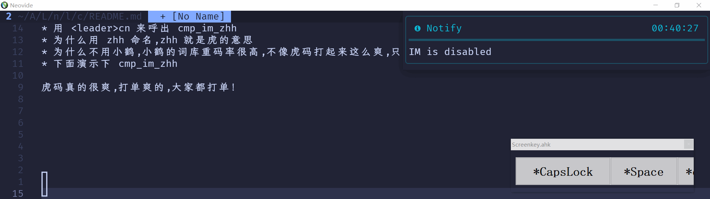

# cmp-im

Input Method source.

<div align="center">

</div>

## Setup

- Defaults configuration

```lua
local cmp_im = require('cmp_im')
cmp_im.setup{
  -- Enable/Disable IM
  enable = false,
  -- IM tables path array
  tables = { },
  -- Function to format IM-key and IM-tex for completion display
  format = function(key, text) return vim.fn.printf('%-15S %s', text, key) end,
  -- Max number entries to show for completion of each table
  maxn = 8,
}
cmp.setup{
    sources = { { name = 'IM' } },
}
```

- Enable/Disable IM

```lua
local map = vim.keymap.set
-- toggle cmp_im
map({ "n" }, "<leader>cn", function()
  vim.notify(string.format("IM is %s", require("cmp_im").toggle() and "enabled" or "disabled"))
end)
```

- Select IM's entry with `<Space>`

```lua
cmp.setup{
  mapping = { ['<Space>'] = cmp.mapping(cmp_im.select(), { 'i' }) },
}
```

-- Cmp insert mode enter
```lua
["<CR>"] = cmp.mapping(require("cmp_im").confirmEnter(), { "i" }),
```

- Cmp cmdline Select IM's entry with `<Space>`

```lua
  -- `/` cmdline setup.
  cmp.setup.cmdline({ "/", "?" }, {
    mapping = cmp.mapping.preset.cmdline({
      ["<Space>"] = {
        c = function(fallback)
          local cmp_im = require("cmp_im")
          if cmp_im.getStatus() and cmp.visible() then
            local entries = cmp.get_entries()
            if #entries > 0 and entries[1].source.name == "IM" then
              return cmp.confirm({ select = true })
            end
          end
          return fallback()
        end,
      },
    }),
    sources = {
      { name = "buffer" },
      { name = "IM" },
    },
  })
  -- `:` cmdline setup.
  cmp.setup.cmdline(":", {
    mapping = cmp.mapping.preset.cmdline({
      ["<Space>"] = {
        c = function(fallback)
          local cmp_im = require("cmp_im")
          if cmp_im.getStatus() and cmp.visible() then
            local entries = cmp.get_entries()
            if #entries > 0 and entries[1].source.name == "IM" then
              return cmp.confirm({ select = true })
            end
          end
          return fallback()
        end,
      },
    }),
    sources = require("cmp").config.sources({
      { name = "path" },
      { name = "IM" },
    }, {
      {
        name = "cmdline",
        option = {
          ignore_cmds = { "Man", "!" },
        },
      },
    }),
```

- Use cmp in telescope

```lua
opts = function()
  return {
      enabled = function()
        local buftype = vim.api.nvim_buf_get_option(0, "buftype")
        if buftype == "TelscopePrompt" then
          return true
        end
        return true
      end,
  }
end
```

## lualine


```lua
lualine_x = {
  {
    function()
      return ""
    end,
    color = function()
      return { fg = require("cmp_im").getStatus() and "green" or "red" }
    end,
},
}
```


## Tables

Table is a plain text file, where each line is a Im-key with one or multiple IM-texts that splited with whitespace character (`<Space>` or `<Tab>`) like below.

> cmp-im has a better performance with IM-key being ascending order, which can be done with `:sort`.

```
a 阿 啊 呵 腌 嗄 锕 吖 錒
```

Here is some table-repos for you:

- [cmp-im-zh](https://github.com/yehuohan/cmp-im-zh): Chinese input with wubi, pinyin
- [ZSaberLv0/ZFVimIM#db-samples](https://github.com/ZSaberLv0/ZFVimIM#db-samples)
- [fcitx-table-extra](https://github.com/fcitx/fcitx-table-extra)
- [fcitx-table-data](https://github.com/fcitx/fcitx-table-data)
