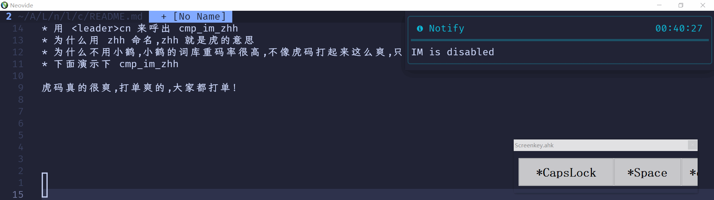

# blink_cmp_im_zhh

[cmp-im](https://github.com/yehuohan/cmp-im) 的j

## 演示图

<div align="center">

</div>

## Setup

- Defaults configuration

```lua
return {
  "Leiyi548/blink_cmp_im_zhh", -- 仓库名，无所谓
  dependencies = { "saghen/blink.cmp" },
  opts = function(_, opts)
    opts.sources = opts.sources or {}
    opts.sources.default = vim.list_extend(opts.sources.default or {}, { "blink_im_zhh" })
    opts.sources.providers = opts.sources.providers or {}
    opts.sources.providers.blink_im_zhh = {
      name = "虎码", -- 显示在菜单里的 source 名
      module = "blink-im-zhh", -- ← 填模块名，不是 repo 名
      opts = { enable = false, maxn = 8 }, -- enable=false 需手动开；想自启改 true
    }
  end,
}
```

- Enable/Disable IM

```lua
local map = vim.keymap.set
-- toggle cmp_im
map({ "n" }, "<leader>cn", function()
  vim.notify(string.format("IM is %s", require("cmp_im").toggle() and "enabled" or "disabled"))
end)
```

- Select IM's entry with `<Space>`

```lua
cmp.setup{
  mapping = { ['<Space>'] = cmp.mapping(cmp_im.select(), { 'i' }) },
}
```

- Cmp insert mode enter

```lua
["<CR>"] = cmp.mapping(require("cmp_im").confirmEnter(), { "i" }),
```

- Cmp cmdline Select IM's entry with `<Space>`

```lua
  -- `/` cmdline setup.
  cmp.setup.cmdline({ "/", "?" }, {
    mapping = cmp.mapping.preset.cmdline({
      ["<Space>"] = {
        c = function(fallback)
          local cmp_im = require("cmp_im")
          if cmp_im.getStatus() and cmp.visible() then
            local entries = cmp.get_entries()
            if #entries > 0 and entries[1].source.name == "IM" then
              return cmp.confirm({ select = true })
            end
          end
          return fallback()
        end,
      },
    }),
    sources = {
      { name = "buffer" },
      { name = "IM" },
    },
  })
  -- `:` cmdline setup.
  cmp.setup.cmdline(":", {
    mapping = cmp.mapping.preset.cmdline({
      ["<Space>"] = {
        c = function(fallback)
          local cmp_im = require("cmp_im")
          if cmp_im.getStatus() and cmp.visible() then
            local entries = cmp.get_entries()
            if #entries > 0 and entries[1].source.name == "IM" then
              return cmp.confirm({ select = true })
            end
          end
          return fallback()
        end,
      },
    }),
    sources = require("cmp").config.sources({
      { name = "path" },
      { name = "IM" },
    }, {
      {
        name = "cmdline",
        option = {
          ignore_cmds = { "Man", "!" },
        },
      },
    }),
```

- Use cmp in telescope

```lua
opts = function()
  return {
      enabled = function()
        local filetype = vim.api.nvim_buf_get_option(0, "filetype")
        if filetype == "TelescopePrompt" then
          return require("cmp_im").getStatus()
        end
        return true
      end,
  }
end
```

## lualine

```lua
lualine_x = {
          {
            function()
              return ""
            end,
            color = function()
              return { fg = require("cmp_im").getChineseSymbolStatus() and "#A7C080" or "grey" }
            end,
          },
          {
            function()
              return "虎"
            end,
            color = function()
              return { fg = require("cmp_im").getStatus() and "#A7C080" or "grey" }
            end,
          },
}
```

## TODO

- [ ] 中文符号就能自动上屏（本来添加了,不知道为什么也会卡顿)
- [ ] ;+英文字符（本来添加了,不知道为什么也会卡顿)

## Tables

Table is a plain text file, where each line is a Im-key with one or multiple IM-texts that splited with whitespace character (`<Space>` or `<Tab>`) like below.

> cmp-im has a better performance with IM-key being ascending order, which can be done with `:sort`.

```
a 阿 啊 呵 腌 嗄 锕 吖 錒
```

Here is some table-repos for you:

- [cmp-im-zh](https://github.com/yehuohan/cmp-im-zh): Chinese input
- [ZSaberLv0/ZFVimIM#db-samples](https://github.com/ZSaberLv0/ZFVimIM#db-samples)
- [fcitx-table-extra](https://github.com/fcitx/fcitx-table-extra)
- [fcitx-table-data](https://github.com/fcitx/fcitx-table-data)
